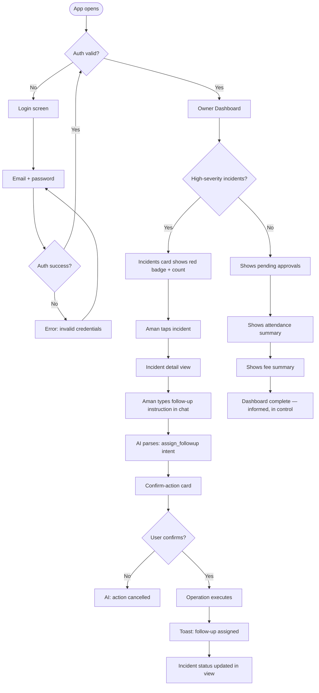
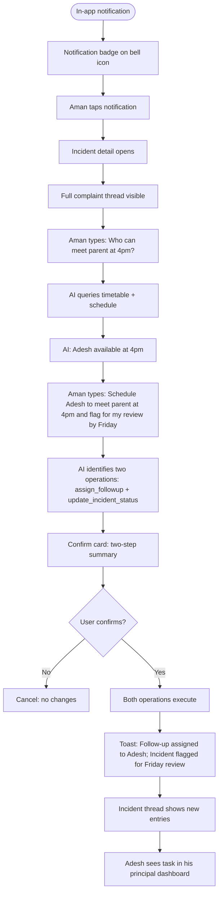
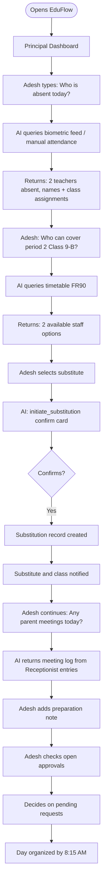
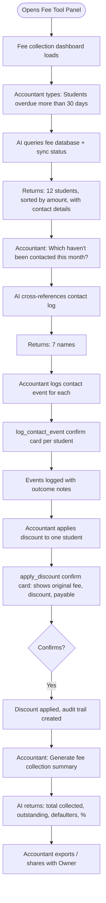
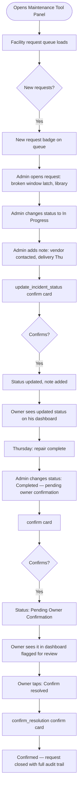
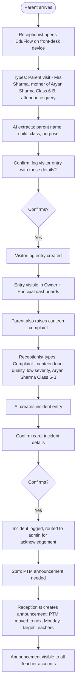
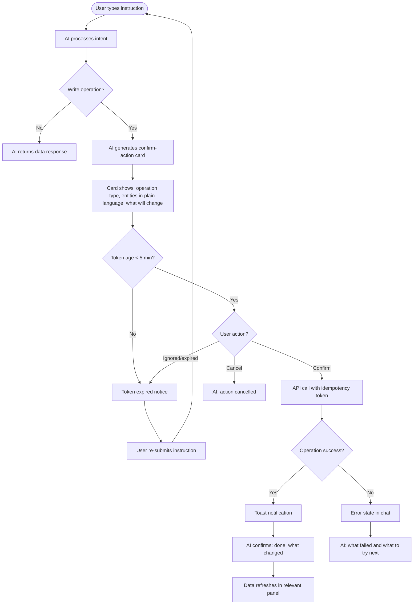

---
stepsCompleted:
  - step-01-init
  - step-02-discovery
  - step-03-core-experience
  - step-04-emotional-response
  - step-05-inspiration
  - step-06-design-system
  - step-07-defining-experience
  - step-08-visual-foundation
  - step-09-design-directions
  - step-10-user-journeys
  - step-11-component-strategy
  - step-12-ux-patterns
  - step-13-responsive-accessibility
  - step-14-complete
status: complete
completedAt: '2026-05-12'
inputDocuments:
  - '_bmad-output/planning-artifacts/prd.md'
  - '_bmad-output/planning-artifacts/architecture.md'
  - '_bmad-output/planning-artifacts/prd-validation-report-v2.md'
  - '_bmad-output/project-context.md'
  - '_bmad-output/implementation-artifacts/stories.md'
workflowType: 'ux-design'
project_name: 'EduFlow Enterprise Upgrade'
user_name: 'Abhimanyusingh'
date: '2026-05-12'
---

# UX Design Specification — EduFlow Enterprise Upgrade

**Author:** Abhimanyusingh
**Date:** 2026-05-12

---

## Executive Summary

### Project Vision

EduFlow is a chat-first school management platform designed to replace the fragmented paper-and-WhatsApp workflows of The Aaryans, a CBSE school group in Uttar Pradesh, India. The platform's core differentiator is that every school operation — attendance, fees, staff management, complaints, facilities, logistics — can be executed through natural-language conversation, with an AI that understands intent and executes operations after user confirmation.

The UX vision for this enterprise upgrade is: **"WhatsApp for school operations."** Every user in the school should feel that EduFlow is as natural and familiar as sending a message, but with the power to run an institution. The design language should feel warm, trusted, and effortless — not corporate, not intimidating, not another ERP system.

The upgrade scope is strictly quality hardening: completing CRUD across all tool panels, enforcing UX state consistency (loading, empty, error), ensuring theme coherence, and providing the mobile-first Owner and Principal experience that makes daily go-live use possible.

### Target Users

**Phase 1 (Go-Live — This Upgrade):**

| Role | Primary Device | Tech Comfort | Primary Use Pattern |
|---|---|---|---|
| Owner (Aman) | Mobile (iOS/Android) | Moderate | Morning dashboard review, AI queries, crisis response — mobile-first, daily |
| Principal (Adesh) | Mobile + Tablet | Moderate | Daily operations, approvals, substitution, attendance — mobile-first, daily |
| Accountant | Desktop | Moderate-High | Fee workflows, discounts, reports — desktop, sustained work sessions |
| Receptionist | Desktop (front desk) | Moderate | Visitor logging, announcements — desktop, episodic throughout day |
| Transport Head | Desktop/Tablet | Moderate | Route and roster management — desktop, batch work |
| IT/Tech Admin | Desktop | High | Request management, tech triage — desktop |
| Maintenance Admin | Desktop/Tablet | Low-Moderate | Facility request queue — desktop, check-in during day |

**Phase 2 (Future):** Teachers (mobile-first), Students (mobile), Parents (mobile)

### Key Design Challenges

1. **Chat-first in a form-first world.** Users are accustomed to ERP-style school software with menus and forms. EduFlow's conversational interface is unfamiliar. The challenge is making chat feel natural and trustworthy — especially for write operations — without making users anxious about what the AI might do.

2. **Mobile-first Owner experience with data density.** Aman needs his morning briefing on a 375px-wide phone screen. He needs to see open complaints, pending approvals, attendance status, and fee summary — in one glance. Balancing information density against mobile usability is the primary layout challenge.

3. **Confirm-action gate design.** Every AI-executed write operation requires a confirmation step. This safety gate must feel like a natural checkpoint — not a form to fill in, not a technical dialog — but a clear, plain-language summary of "here's what's about to happen." It must be impossible to miss but not anxiety-inducing.

4. **Multi-role consistency on one codebase.** Seven distinct admin profiles, each with different tool panels, different data scopes, different interaction modes. All must feel like the same product while surfacing only what's relevant to each role.

5. **Vernacular user base.** Many users are Hindi-primary speakers who use English for professional tools. UI copy must be clear, jargon-free, and unambiguous. Error messages must be helpful, not cryptic. The AI must understand Hinglish input gracefully.

### Design Opportunities

1. **Institutional memory as UX superpower.** The ability to ask "What happened with Rahul's parents last month?" and get an instant, accurate answer is unprecedented in school management software. The design should make this feel magical — surfaced prominently, celebrated as the core value proposition.

2. **Replacing the morning ritual.** Aman currently opens five WhatsApp conversations and flips through a diary every Monday morning. EduFlow can replace this entire ritual with one screen. The Owner dashboard is a design opportunity to create a genuinely better morning experience.

3. **Progressive trust-building.** The confirm-action gate, far from being a friction point, can be designed as a trust builder — every time the AI shows "here's exactly what I'm about to do, you decide," it builds user confidence in the system.

---

## Core User Experience

### Defining Experience

The defining experience of EduFlow is: **"Type what you need, confirm, done."**

Like how WhatsApp made messaging effortless by removing the email-client ceremony, EduFlow makes school operations effortless by removing the menu-navigation ceremony. The user types a natural sentence — "Mark the broken chair in Class 4 as resolved" — and the system responds with exactly what it understood and what it will do. The user confirms. Done.

This three-step loop — **Type → Review → Confirm** — is the atomic unit of EduFlow's UX. Every design decision should serve this loop.

### Platform Strategy

**Primary Platform:** Web (progressive web app pattern, not native)

**Device Distribution:**
- Owner + Principal: 80%+ mobile (iOS Safari, Android Chrome) — treated as primary
- All Admin profiles: Desktop/tablet first — secondary mobile access must not break but need not be optimized

**Offline:** Not in scope for Phase 1. The platform assumes connectivity. Degradation when Azure OpenAI is unavailable is handled gracefully (tool panels remain functional).

**Input modality:** Touch-first for Owner/Principal views. Keyboard-primary for admin tool panels.

### Effortless Interactions

The following interactions must feel effortless — zero friction, zero cognitive load:

1. **Sending a chat message.** Tap input, type, send. The input stays visible with the keyboard open (FR76). This is non-negotiable.

2. **Reading the Owner dashboard.** Aman opens the app and knows — in 10 seconds without scrolling — what needs his attention today. Priority order: high-severity incidents, pending approvals, today's attendance, fee summary (FR83).

3. **Confirming a write operation.** The confirm card appears, the user reads the plain-language summary, taps "Confirm." No form, no second thoughts about what the system will do.

4. **Logging a visitor / complaint.** The Receptionist types one sentence and the system extracts entity, purpose, and severity. Frictionless entry is the core of institutional memory.

5. **Searching historical records.** "What did we discuss with Rahul's parents last month?" returns an instant result from conversation. No database query UI, no date pickers.

### Critical Success Moments

| Moment | Description | Design Implication |
|---|---|---|
| First Monday morning | Aman uses EduFlow instead of his diary for the first time — and it works | Dashboard must be immediately comprehensible on mobile, no learning curve |
| First AI write operation | A user confirms an AI-suggested action and sees the result applied correctly | Confirm card must be crystal-clear, result must be immediately visible |
| First historical query | "What happened last Tuesday?" returns correct, complete answer | AI response must show source data, not just a summary |
| First high-severity alert | Aman sees the incident notification and can act from his phone | Notification must reach him; incident detail must be actionable on mobile |
| First substitution | Adesh assigns a substitute through EduFlow without calling anyone | Substitution flow must be completable in 3 taps |

### Experience Principles

1. **Conversation first, form second.** Every operation can be initiated from the chat interface. Tool panel forms are always available as a fallback but should never feel like the only path.

2. **Show what you understood.** Before executing anything, the system shows its understanding in plain language. Users should never wonder what the AI parsed from their input.

3. **Instant feedback, no mystery.** Every write operation shows a visible result immediately — updated status, new record in list, confirmation message. No silent success.

4. **One-thumb usability for Owner.** Every primary Owner action reachable within the top 75% of a 375px portrait viewport, single-thumb, no repositioning required.

5. **Calm authority.** The design should feel like a trusted senior colleague — authoritative but not bureaucratic, helpful but not chatty, present but not intrusive.

---

## Desired Emotional Response

### Primary Emotional Goals

**Primary:** Control and clarity — "I know exactly what's happening in my school right now."

**Secondary:** Trust — "This system does what I tell it. It never does anything I didn't approve."

**Tertiary:** Relief — "I don't need my diary anymore. It's all here."

These emotions must characterize the experience specifically for Owner (Aman) and Principal (Adesh), whose daily-use adoption is the go-live success metric.

For Admin profiles, the primary emotion is **efficiency** — the platform gets out of the way and lets them complete their workflows without friction.

### Emotional Journey Mapping

| Stage | Desired Emotion | Design Trigger |
|---|---|---|
| First login | Curiosity + mild reassurance | Clean, minimal dashboard — not overwhelming |
| First successful AI query | Impressed, slightly amazed | AI returns accurate live data conversationally |
| First write operation (pending confirm) | Cautious attention | Confirm card is prominent, clear, unambiguous |
| After confirm executes | Satisfaction + growing trust | Immediate visible result; success feedback |
| Dashboard on Monday morning | Relief + control | Prioritized summary answering "what do I need to know?" |
| When something fails | Informed, not anxious | Error state shows what happened and what to do — never a blank screen |
| After a week of daily use | Dependence (healthy) | The old diary starts feeling unnecessary |

### Micro-Emotions

**Confidence over confusion:** Every interactive element has a clear label, a visible state, and predictable behavior. No guessing what a button does.

**Trust over skepticism:** The confirm-action gate is the primary trust mechanism. By consistently showing "here's exactly what I will do" before acting, the system trains users to trust it.

**Accomplishment over frustration:** Every completed workflow (complaint logged, approval decided, substitution assigned) ends with a clear "done" moment — toast notification, status update, closed card.

**Calm over anxiety:** Error states must be calm and directive — "Fee sync is paused, last updated 45 min ago" — not alarming. The system communicates stability even during degraded states.

### Design Implications

| Emotional Goal | UX Design Approach |
|---|---|
| Control | Dashboard prioritization by severity; real-time data; unread counts with badges |
| Trust | Confirm-action gate on every write; plain-language operation summaries; audit trail visible to users |
| Relief | AI-powered morning briefing replacing manual information gathering; institutional memory via search |
| Efficiency | Minimal tap-depth for Admin workflows; typeahead in search; bulk actions where relevant |
| Calm | Muted, not alarming error states; staleness indicators instead of errors; graceful degradation messaging |

### Emotional Design Principles

1. **Never leave users in the dark.** Loading states, empty states, error states — every data surface has one. No blank screens, no spinners with no context.
2. **Let the AI earn trust incrementally.** Start with read-only queries that users can verify. Write operations always require explicit confirmation. Trust is built by predictable behavior, not by claiming the AI is trustworthy.
3. **Celebrate completions.** When Aman resolves a complaint or Adesh approves a leave request, the UI acknowledges it — a subtle success state, not just silence.
4. **Make degradation dignified.** When Azure OpenAI is down, the platform says so calmly and keeps working. No crashes, no full-screen error pages.

---

## UX Pattern Analysis & Inspiration

### Inspiring Products Analysis

**WhatsApp**
- Solves the core communication problem elegantly: type, send, done
- Onboarding: immediate, no ceremony — users start in the conversation
- Navigation: minimal — chat list + specific chat + settings; nothing else visible
- Most innovative interaction: message delivery status (sent → delivered → read) — users always know where they stand
- Error handling: graceful — "message not delivered" with retry is calm and clear
- Relevance to EduFlow: The chat interface pattern, the conversation-centric layout, and the delivery-status mental model map directly to EduFlow's "Type → Review → Confirm" loop

**Google Classroom / Google Workspace (India school market familiarity)**
- Solves: organizing school communication across roles
- What works: stream + assignment pattern; role-based visibility; announcement targeting
- What doesn't work: too many clicks to get anywhere; form-heavy entry
- Anti-pattern to avoid: the "fill this form to do anything" paradigm

**Teachmint (competitive product)**
- Form-first paradigm: every operation is a menu → form → submit
- Works for tech-comfortable users; fails for mobile-primary, time-pressured principals
- Anti-pattern: navigation depth of 4+ levels to reach common operations
- Learning from failure: EduFlow's chat reduces operation depth to 1 step (type intent)

**Zomato / Swiggy (familiar Indian mobile UX patterns)**
- Establishes the mobile-first interaction vocabulary for Indian users
- Key pattern: bottom navigation, card-based content, large touch targets, clear status badges
- Notification pattern: prominent badge + actionable notification content (not just "you have a notification")
- Relevance: Owner and Principal on mobile should feel as natural as ordering food — the interaction vocabulary is already learned

### Transferable UX Patterns

**Navigation Patterns:**
- Bottom navigation bar for Owner/Principal mobile view (familiar, thumb-accessible)
- Fixed sidebar at 120px for desktop — already implemented; maintain consistency
- Persistent chat access from every screen via floating button or sidebar

**Interaction Patterns:**
- WhatsApp-style message bubbles for the chat interface (already implemented — reinforce, don't diverge)
- Card-based content blocks for complaint logs, approval requests, incident threads
- Status badge pattern (Zomato/Swiggy) for unread counts on dashboard items
- Inline status updates (WhatsApp delivery status → EduFlow's "In Progress → Completed → Pending Owner Confirmation")

**Visual Patterns:**
- Dark-first default theme (already implemented) — professional, reduces eye strain in office/school settings
- High-contrast status indicators: color + icon + label (never color alone per NFR)
- Progressive disclosure: summary card → tap to expand full thread

### Anti-Patterns to Avoid

1. **Menu-first navigation.** Never require users to navigate 3+ levels to reach a common operation. All primary workflows accessible from chat + 1-level tool panel.

2. **Form-gate for everything.** The Receptionist logging a visitor should type one sentence, not fill 8 fields. Forms exist for complex data entry (fee discount configuration, timetable setup) — not for common operations.

3. **Silent success.** When an AI operation executes, the user must see a visible change. No "your request has been processed" and nothing else. Show the updated record.

4. **Alarming error states.** "Error 500: Internal Server Error" is unacceptable. Every error state must explain what happened in plain language and offer a recovery path.

5. **Desktop-first on mobile.** No horizontal scrolling. No non-tappable elements smaller than 44x44px. No modals that overflow the viewport when the keyboard is open.

6. **Role-agnostic UI.** Showing the Maintenance Admin fee records, or showing the IT Admin facility requests — namespace isolation must be reflected in the UI, not just enforced at the API layer.

### Design Inspiration Strategy

**Adopt:**
- WhatsApp's message thread pattern for the chat interface — users already understand it
- Bottom navigation for mobile Owner/Principal views
- Card-based content hierarchy for dashboard items
- Status badge pattern for unread counts

**Adapt:**
- WhatsApp's "delivered/read" status → EduFlow's operation status thread (submitted → in-progress → resolved → confirmed)
- Zomato's bottom-up card reveal for confirm-action gate (feels natural on mobile, focuses attention)
- Google Classroom's stream pattern for announcement feeds

**Avoid:**
- Any ERP-style menu tree navigation
- Form-heavy operation workflows for common tasks
- Color-only status communication
- Desktop-first layouts pushed to mobile

---

## Design System Foundation

### Design System Choice

**Chosen Foundation:** Tailwind CSS + shadcn/ui (Radix UI) — already installed and in use

This is a brownfield project with an existing component library. The design system choice is constrained and correct: do not introduce a competing UI library. The upgrade hardening must work within the existing system.

**Component Library:** shadcn/ui components in `frontend/src/components/ui/` — always import from there; never use Radix UI primitives directly

**Icon System:** Lucide React exclusively — no mixing of icon sets

**Token System:** CSS variables defined in `index.css` (dark theme default) and `theme.css` (light theme override via `[data-theme="light"]`)

### Rationale for Selection

1. **Zero migration cost.** Changing the design system would require rebuilding every existing component. Not in scope for an enterprise quality upgrade.
2. **Proven component quality.** shadcn/ui has production-quality accessibility baked in — ARIA patterns, keyboard navigation, focus management — which EduFlow needs for WCAG partial compliance.
3. **Tailwind's utility approach** maps directly to the CSS variable token system already in place — new components extend existing patterns without conflicts.
4. **shadcn/ui's composability** allows role-specific tool panels to share foundation components while maintaining distinct layouts.

### Implementation Approach

**Token hierarchy (existing, must be preserved):**
```
CSS Variables (index.css / theme.css)
    ↓
Tailwind arbitrary values (when CSS var doesn't exist)
    ↓
shadcn/ui component defaults
    ↓
Component-level style overrides via className prop
```

**Do not:**
- Add raw hex colors to component files (`#1C2D3B` etc.) — use CSS variables
- Add a new UI library (Material UI, Ant Design, etc.)
- Override shadcn/ui component internals — extend via className or wrapper components

### Customization Strategy

The existing codebase has **tool-specific accent colors** defined in `design_guidelines.json`. These must be applied consistently:

| Tool | Accent Color | CSS Variable |
|---|---|---|
| School Pulse / Attendance | `#F97316` (orange) | `--accent-pulse` |
| Fee Collection | `#3B82F6` (blue) | `--accent-fee` |
| Staff / People | `#10B981` (green) | `--accent-staff` |
| Student Database | `#8B5CF6` (purple) | `--accent-student` |
| Announcements | `#F59E0B` (amber) | `--accent-announce` |
| Transport | `#06B6D4` (cyan) | `--accent-transport` |
| Issue Tracker | `#EF4444` (red) | `--accent-issues` |

These accents appear in:
- Tool panel header icon color
- Tool panel active state border/highlight
- Dashboard summary card left border
- Sidebar icon active state

---

## 2. Core User Experience

### 2.1 Defining Experience

**EduFlow's defining experience:** "Type what you need — in plain language — and the system handles it."

Like Spotify's "Play any song instantly" promise, EduFlow's promise is: **"Answer any operational question or execute any school operation — in one sentence."**

The interaction pattern:
1. User types a natural-language query or instruction in the chat input
2. AI processes it, optionally calls tools to retrieve data
3. AI responds with data (for queries) or a confirm-action card (for write operations)
4. User confirms (for writes) — data change happens
5. User sees the result immediately

### 2.2 User Mental Model

**Current mental model (before EduFlow):**
- "To find information, I call someone, check a register, or look in WhatsApp"
- "To take an action, I tell someone in person or send a WhatsApp"
- "To track progress, I remember, follow up verbally, or hope it was noted somewhere"

**Target mental model (with EduFlow):**
- "To find information, I ask EduFlow"
- "To take an action, I tell EduFlow — and confirm what it understood"
- "To track progress, I ask EduFlow what the current status is"

**Transition challenge:** Users need to internalize that EduFlow understands operational intent, not just keyword search. The chat interface must feel responsive enough (first token ≤3s) to reinforce this mental model in early sessions.

**Familiar anchor:** The chat interface looks and feels like WhatsApp. This is intentional. The mental model transfer from "messaging a colleague" to "querying EduFlow" is the shortest cognitive path for this user base.

### 2.3 Success Criteria

| Criterion | Observable Signal |
|---|---|
| Chat feels natural | Users initiate from chat rather than navigating to tool panels |
| Confirm gate builds trust | Users read the confirm card before tapping — not dismissing it reflexively |
| Mobile dashboard sufficient | Aman answers operational questions without opening a laptop |
| AI response is accurate | No manual correction of AI-returned data required in the first week |
| Write operations succeed | No "I thought I confirmed it but nothing happened" reports |

### 2.4 Novel UX Patterns

**Confirm-Action Card — Novel Pattern:**
The combination of AI intent-parsing + a structured confirmation UI is novel in the school management space. No competing product does this.

Design guidance:
- The card appears inline in the conversation, not as a system modal
- It shows: what operation, what entity (in user-readable terms — student name, not student_id), what will change
- Two clear actions: "Confirm" (primary, green or role accent) and "Cancel" (secondary, neutral)
- Token expiry (5 minutes) is not shown as a countdown — instead, an expired token shows a gentle "this confirmation expired — please re-request" message

**Institutional Memory Query — Novel Pattern:**
When the user asks a historical question ("What did we discuss with Sharma's parents last month?"), the AI returns a conversation-extracted summary with source reference. No existing school software offers conversational retrieval of historical records.

Design guidance:
- AI responses to historical queries show a "Source: Incident log, Oct 15" attribution chip
- Tapping the attribution chip navigates to the full record in the tool panel
- This creates the mental model: "The AI knows, and I can verify"

### 2.5 Experience Mechanics

**Chat Loop Mechanics:**

1. **Initiation:** User taps the chat input (always visible, pinned to bottom of viewport). Keyboard opens. Input stays visible above keyboard (FR76).

2. **Interaction:** User types. No autocomplete suggestions for Phase 1 (reduces complexity). Send button activates when input is non-empty.

3. **Processing Feedback:** Animated "thinking" indicator (`ThinkingProcess` component) appears immediately after send. This signals "I received your message and am working on it." First token arrives within 3 seconds.

4. **Response:**
   - For queries: Streaming text response with tool result cards for structured data
   - For writes: Confirm-action card appears as a message in the thread

5. **Confirmation:**
   - User reads the confirm card (shows entity names, not field IDs)
   - Taps "Confirm" or "Cancel"
   - If confirmed: operation executes, result appears as the next AI message
   - If cancelled: AI acknowledges ("Got it, I've cancelled that.")

6. **Completion Feedback:** Toast notification (Sonner) for successful writes. Persistent status update visible in relevant tool panel.

---

## Visual Design Foundation

### Color System

**Theme Architecture:** Dark-first (default) with light theme override

**Base Semantic Tokens (existing — must be used, never bypass with hex):**

| Token | Dark Value | Light Value | Usage |
|---|---|---|---|
| `--bg-primary` | `#0D0D18` | `#F8F9FA` | App background |
| `--bg-card` | `#1C1C28` | `#FFFFFF` | Card, panel backgrounds |
| `--bg-elevated` | `#252535` | `#F1F3F5` | Elevated surfaces, dropdowns |
| `--border` | `#2A2A3D` | `#E0E0E0` | Dividers, card borders |
| `--text-primary` | `#E8E8F0` | `#1A1A2E` | Primary text |
| `--text-secondary` | `#8888A4` | `#6B6B80` | Secondary text, labels |
| `--text-muted` | `#555570` | `#9999AA` | Placeholder, timestamps |
| `--accent-primary` | `#6366F1` | `#6366F1` | Primary actions (invariant) |
| `--accent-success` | `#10B981` | `#059669` | Success states |
| `--accent-warning` | `#F59E0B` | `#D97706` | Warning states |
| `--accent-error` | `#EF4444` | `#DC2626` | Error states, high-severity |

**Chat-specific tokens (existing — preserve):**
- User message bubble: `bg-[#1C1C28] border border-[#222230] rounded-2xl`
- AI message: Transparent background, leading avatar
- Confirm action card: Elevated surface with accent border

**Accessibility requirement:** All text on backgrounds must meet 4.5:1 contrast ratio in both themes (NFR requirement).

**Status Color System:**

| Status | Color | Icon | Usage |
|---|---|---|---|
| High Severity / Critical | `--accent-error` (#EF4444) | AlertTriangle | High-severity incidents |
| Warning / Pending | `--accent-warning` (#F59E0B) | Clock | Pending approvals, approaching deadlines |
| Success / Resolved | `--accent-success` (#10B981) | CheckCircle | Completed operations |
| Info / Active | `--accent-primary` (#6366F1) | Info | In-progress states |
| Neutral / Unknown | `--text-muted` | Minus | Unknown / not started |

**Rule:** Never use color alone to convey status. Always pair color with an icon and a text label.

### Typography System

**Font Stack (existing — do not change without explicit approval):**
- **Body / UI:** `Inter` — loaded from Google Fonts in `index.css`
- **Monospace / Code / IDs:** `JetBrains Mono`

**Type Scale:**

| Level | Size | Weight | Line Height | Usage |
|---|---|---|---|---|
| Display | 28px / 1.75rem | 700 | 1.2 | Hero headers (rare) |
| H1 | 24px / 1.5rem | 600 | 1.3 | Page/panel titles |
| H2 | 20px / 1.25rem | 600 | 1.35 | Section headers |
| H3 | 16px / 1rem | 600 | 1.4 | Card titles, subsections |
| Body | 14px / 0.875rem | 400 | 1.6 | Primary body text |
| Body Small | 12px / 0.75rem | 400 | 1.5 | Secondary text, timestamps |
| Label | 11px / 0.6875rem | 500 | 1.4 | Form labels, badges |
| Mono | 13px / 0.8125rem | 400 | 1.5 | IDs, codes, technical data |

**Chat Message Typography:**
- User messages: Body (14px), `--text-primary`
- AI response text: Body (14px), `--text-primary`
- Thinking indicator: Body Small (12px), `--text-muted`, italic
- Timestamp: Label (11px), `--text-muted`
- Tool result headings: H3 (16px), tool accent color

**Mobile type adjustments:**
- Minimum font size: 14px (no 11px labels in interactive elements on mobile)
- Dashboard summary numbers: H1 (24px) for at-a-glance readability

### Spacing & Layout Foundation

**Base unit:** 4px

**Spacing scale:**
```
2px  — micro (icon padding, badge border)
4px  — xs (inline gaps, chip padding)
8px  — sm (element internal padding)
12px — md (card internal padding, tight groups)
16px — lg (standard card padding, section gaps)
24px — xl (panel padding, large card padding)
32px — 2xl (section separation, modal padding)
48px — 3xl (page-level section separation)
```

**Layout constants (existing — must be respected):**
- Sidebar width: **120px fixed** — all content areas must offset by this
- Chat input pin: `bottom: 0; left: 120px` — never obstructed
- Floating assistant: Bottom-right of content area, above input

**Grid approach:**
- Mobile: Single column, full-width cards
- Tablet (768px+): 2-column for dashboard summary cards; full-width for tool panels
- Desktop (1024px+): 3-column dashboard grid; standard tool panel layout

**Card anatomy:**
```
Card container: bg-[--bg-card], border [--border], rounded-xl, p-4
  ├── Card header: flex, justify-between, align-center, mb-3
  │     ├── Icon (accent color, 18px) + Title (H3)
  │     └── Badge / Action button
  ├── Card body: space-y-2
  └── Card footer (optional): pt-3, border-t [--border], flex, gap-2
```

### Accessibility Considerations

**Minimum requirements (from NFR):**
- Color contrast ≥ 4.5:1 for all body text in both themes
- Visible focus state on all interactive elements: 2px solid outline, ≥3:1 contrast against adjacent background
- All form inputs have associated labels (no placeholder-only labels)
- No information conveyed through color alone (always pair with icon + text)

**Touch target compliance (FR75):**
- Minimum 44×44px for all interactive elements on mobile
- All primary Owner/Principal actions reachable within the top 75% of a 375px portrait viewport

**Language considerations:**
- All UI copy in English with clear, jargon-free language
- AI responses must handle Hinglish input gracefully (handled at LLM layer, not UX layer)
- Timestamps in IST; date format: DD Mon YYYY (e.g., "12 May 2026") — avoids MM/DD vs DD/MM ambiguity

---

## Design Direction Decision

### Design Directions Explored

Based on the project context — a chat-first school management platform for Indian users, mobile-first for Owner and Principal, desktop-primary for Admin profiles — the following design directions were evaluated:

1. **WhatsApp-inspired Dark:** Deep dark background (#0D0D18), purple accent, chat-dominant layout with collapsed tool panels
2. **Professional Dashboard Dark:** Card-grid first, chat as secondary panel, structured data dominance
3. **Hybrid Split-Screen:** Chat on left, contextual tool panel on right — desktop-only viability
4. **Mobile-Card-First:** Bottom navigation, full-width cards, minimal sidebar, chat accessible via bottom tab

### Chosen Direction

**Direction: WhatsApp-inspired Dark (current implementation, hardened)**

The existing codebase already implements this direction correctly at the layout level. The enterprise upgrade must harden and complete this direction rather than redesign it. Key elements:

- Dark-first (#0D0D18 background, #1C1C28 cards) — already correct
- 120px fixed sidebar on desktop — already correct
- Chat interface as primary content area — already correct
- Tool dashboard as right-side panel — already correct
- Floating chat assistant for non-chat screens — already correct

The design work for this upgrade is **completion and consistency** within the chosen direction, not exploration of new directions.

### Design Rationale

1. **User familiarity:** The dark messaging-app aesthetic is the most familiar interface paradigm for Indian mobile users (WhatsApp dark mode is ubiquitous).
2. **Eye comfort:** School admins use these systems in office environments, often on screens for extended periods. Dark theme reduces eye strain.
3. **Chat centrality:** The chat interface is the primary product surface — the design should frame it as such, not bury it under navigation.
4. **Implementation continuity:** Maintaining the existing visual direction avoids breaking changes to a live system with an active client.

### Implementation Approach

The upgrade targets the following visual consistency gaps:

1. **Theme coherence:** Audit all tool panels for hardcoded hex colors. Replace with CSS variables. Every panel must render correctly in both dark and light themes.
2. **State completeness:** Add loading, empty, and error states to every data-displaying component that lacks them.
3. **Spacing normalization:** Audit for inconsistent padding/margin values. Normalize to the 4px grid.
4. **Accent consistency:** Ensure tool-specific accent colors are applied consistently per the `design_guidelines.json` mapping.

---

## Design Direction: HTML Mockup Reference

*Note: In autonomous mode, the HTML design direction showcase (ux-design-directions.html) is described below rather than generated as a separate file, as all design decisions are already defined by the existing codebase direction.*

**Key screen compositions:**

**Owner Dashboard (Mobile — 375px):**
```
┌─────────────────────────────┐
│  ≡  EduFlow    🔔(3)  👤   │  ← Header: hamburger, notifications, profile
├─────────────────────────────┤
│  Good morning, Aman          │
│  Tuesday, 12 May 2026        │
├─────────────────────────────┤
│  ┌───────────────────────┐  │
│  │ 🚨 High Severity (2)  │  │  ← Priority 1: Incidents (red border)
│  │ Teacher complaint...  │  │
│  │ Parent escalation...  │  │
│  └───────────────────────┘  │
│  ┌───────────────────────┐  │
│  │ ⏳ Pending (5)        │  │  ← Priority 2: Approvals (amber border)
│  └───────────────────────┘  │
│  ┌───────────────────────┐  │
│  │ 👥 Attendance Today   │  │  ← Priority 3: Attendance (green border)
│  │ 42/45 present         │  │
│  └───────────────────────┘  │
│  ┌───────────────────────┐  │
│  │ 💰 Fee Collection     │  │  ← Priority 4: Fees (blue border)
│  │ ₹2.4L / ₹3.1L (77%)  │  │
│  └───────────────────────┘  │
├─────────────────────────────┤
│  [💬 Ask EduFlow...]        │  ← Persistent chat input (pinned bottom)
└─────────────────────────────┘
```

**Chat Interface (Mobile):**
```
┌─────────────────────────────┐
│  ← Chat         ⋮           │
├─────────────────────────────┤
│                             │
│  ┌─────────────────────┐   │
│  │ What happened over  │   │  ← User message (right-aligned, dark bubble)
│  │ the weekend?        │   │
│  └─────────────────────┘   │
│                             │
│  🤖 [Thinking...]          │  ← ThinkingProcess indicator
│                             │
│  Here's a summary of        │  ← AI response (left-aligned, no bubble)
│  weekend activity:          │
│                             │
│  📋 2 parent visits logged  │  ← Tool result card (accent border)
│  🔧 1 maintenance request   │
│  👤 1 staff complaint filed │
│                             │
├─────────────────────────────┤
│  [Type a message...    ] ▶  │  ← Input pinned above keyboard
└─────────────────────────────┘
```

**Confirm-Action Card (inline in chat):**
```
┌─────────────────────────────────────┐
│  ⚡ Confirm Action                   │  ← Accent border, elevated bg
│                                     │
│  I'm about to:                      │
│  Assign follow-up on                │
│  "Sharma parent complaint"          │
│  to Adesh (Principal)               │
│  Due: Wednesday, 14 May             │
│                                     │
│  Note: "Review with owner by Fri"   │
│                                     │
│  ┌───────────┐  ┌─────────────┐    │
│  │  Confirm  │  │   Cancel    │    │  ← Green primary, neutral secondary
│  └───────────┘  └─────────────┘    │
└─────────────────────────────────────┘
```

---

## User Journey Flows

### Journey 1: Aman — Morning Dashboard Review

**Entry:** Aman opens EduFlow at 8:30 AM on Monday



**Key UX decisions:**
- Dashboard sections render in strict priority order (FR83) — high-severity always first
- Each section is a tappable card that expands inline, not navigates away
- "Ask EduFlow" input persists at bottom throughout — always one tap to query

### Journey 2: Aman — Crisis Complaint (High-Severity)

**Entry:** High-severity incident notification received while off-site



**Key UX decisions:**
- High-severity notifications show on all devices — Owner must not miss them
- Incident thread is reverse-chronological by default (FR38b)
- Multi-step AI operations (assign + update) shown as a combined confirm card listing both changes
- Mobile viewport: incident detail must not require horizontal scroll

### Journey 3: Adesh — Daily Operations (Principal)

**Entry:** Adesh opens EduFlow at 7:45 AM



**Key UX decisions:**
- Timetable-aware substitution workflow: AI only surfaces truly available staff (not just "not absent")
- Substitution confirm card shows: absent teacher, substitute, class, period — all in plain language
- Parent meeting entries from Receptionist are visible to Principal (cross-role data sharing per RBAC)

### Journey 4: Accountant — Fee Workflow

**Entry:** Accountant opens EduFlow on desktop, Tuesday morning



**Key UX decisions:**
- Discount confirm card must show: original amount, each discount applied, final payable — no black-box totals (FR26)
- Contact log entry is lightweight: one sentence captures call outcome
- Fee summary is available conversationally (no separate "reports" section needed)

### Journey 5: Maintenance Admin — Facility Request Queue

**Entry:** Maintenance Admin opens EduFlow, morning check



**Key UX decisions:**
- Maintenance Admin never sees IT/Tech requests (namespace isolation — FR53)
- Status thread is append-only — Admin adds notes, original entry preserved
- Owner confirmation is a separate explicit step, not an automatic closure

### Journey 6: Receptionist — Visitor Log and Announcement

**Entry:** Parent arrives at reception at 11 AM



**Key UX decisions:**
- Visitor log entry is one sentence — not a multi-field form
- Complaint severity is set by Receptionist; high-severity auto-escalates (FR37)
- Announcement targeting (FR56) via role group selector in the announcement creation UI

### Journey 7: Confirm-Action Gate — Universal Pattern

**This flow applies across all write operations:**



**Key UX decisions:**
- Confirm card always shows entity names (student name, not student_id) — per FR9
- Expired token shows a gentle message, not an error — prevents anxiety
- Duplicate submission (network retry) returns original result silently — per FR22/FR88

### Journey Patterns

**Pattern 1: Type → Confirm → See Result**
All write operations follow this pattern. No exceptions. No "I'll save it in the background" states.

**Pattern 2: Query → Data Card → Drill In**
All read operations return a structured data card. Tapping any card item navigates to the full record in the relevant tool panel.

**Pattern 3: Error → Explain → Recover**
All error states (API failure, validation failure, degraded service) show:
1. What happened (plain language)
2. What the user can do next (specific action, not "please try again")
3. Current system status if relevant (staleness indicator, service status)

**Flow Optimization Principles**

- **Minimize tap depth:** Common operations (log incident, confirm approval, update status) in ≤3 taps from the chat interface
- **Avoid context switching:** AI can navigate the tool panel (`navigate` SSE event) when the user's query is better served by the tool panel view — but always with a clear "I'm showing you X" message
- **Progressive disclosure:** Summary → tap → detail → action. Never show full detail before the user asks.
- **Keyboard-first on desktop:** All form fields in tool panels navigable by Tab. All list items have keyboard focus states.

---

## Component Strategy

### Design System Components

**Available from shadcn/ui (already installed — reuse, never re-implement):**

| Component | Usage in EduFlow |
|---|---|
| `Button` | All action buttons — primary, secondary, destructive variants |
| `Input` | Chat input, search fields, form inputs |
| `Textarea` | Multi-line note entry, announcement body |
| `Select` | Role filter, status filter, discount type selector |
| `Dialog` / `Sheet` | Modal overlays, bottom sheets on mobile |
| `Popover` | Date pickers (with react-day-picker 8.x), dropdowns |
| `Badge` | Status badges, unread counts |
| `Table` | Data tables in tool panels (student list, fee list, etc.) |
| `Tabs` | Tool panel tab navigation |
| `Separator` | Section dividers |
| `Skeleton` | Loading states for all data-fetching components |
| `Alert` | Error and warning banners |
| `Tooltip` | Help text for icons and truncated content |
| `Avatar` | User profile images |
| `ScrollArea` | Scrollable containers (conversation thread, long lists) |
| `Command` | Future: command palette / quick actions |

### Custom Components

**Custom components required for EduFlow-specific patterns:**

---

**ConfirmActionCard**

**Purpose:** Display a structured pre-confirmation summary for AI-executed write operations before any data mutation.

**Content:** Operation type header, entity names (plain language), change summary, expiry state

**Actions:** Confirm (primary, role-accent color), Cancel (secondary, neutral)

**States:**
- Default: Elevated card, accent border-left, two action buttons
- Expired (>5 min): Muted appearance, "This confirmation expired — please re-request" message, no action buttons
- Processing (after Confirm tap): Loading spinner on Confirm button, Cancel disabled
- Error: Error banner above card, "Something went wrong — please try again" with retry option

**Variants:** Single operation (most common), Multi-operation (when AI batches two related writes)

**Accessibility:** Role="dialog" equivalent focus management — focus moves to card on appearance; Escape key cancels; Enter key confirms

---

**MessageRenderer**

**Purpose:** Render AI response content including streaming text, tool result cards, and embedded ConfirmActionCard.

**Content:** Streamed text (markdown rendered), tool result blocks, structured data tables, thinking process indicator, confirm action card

**States:**
- Streaming: Characters appear progressively; cursor blink at end
- Tool result: Card with tool-specific accent and icon
- Complete: Full message with timestamp
- Error: Red accent, error explanation

**Variants:** User message (right-aligned dark bubble), AI message (left-aligned, no bubble background)

---

**ThinkingProcess**

**Purpose:** Show AI processing state between user message submission and first token.

**Content:** Animated dots or shimmer with contextual text ("Checking attendance records...", "Looking up fee status...")

**States:** Animating (during processing), Hidden (once first token arrives)

**Accessibility:** aria-live="polite" region; screen reader announces "EduFlow is thinking"

---

**DashboardSummaryCard**

**Purpose:** Display a prioritized summary item on the Owner/Principal dashboard (incidents, approvals, attendance, fees).

**Content:** Icon (tool accent), category label, count/value, trend indicator, tap to expand

**States:**
- Default: Collapsed (shows count + label)
- Expanded: Shows top 3 items inline with "See all" link
- Empty: Empty state with contextual guidance
- Loading: Skeleton

**Variants:**
- Critical (incidents, high-severity): Red left-border
- Warning (pending approvals, deadlines): Amber left-border
- Informational (attendance, fees): Tool accent color left-border

**Accessibility:** Expandable region uses aria-expanded; keyboard-navigable expand/collapse

---

**IssueStatusThread**

**Purpose:** Display a chronological thread of status updates and notes on a complaint, incident, or request record.

**Content:** Entries in reverse-chronological order; each entry: author, timestamp, content, status change indicator

**States:** Default view (last 5 entries), Full history (all entries with pagination)

**Variants:** Complaint/incident thread, Maintenance facility request thread, Tech request thread

**Accessibility:** Each entry has timestamp as aria-label; thread is a live region for new entry notifications

---

**NotificationDrawer**

**Purpose:** Show notification history with direct navigation to source records.

**Content:** Reverse-chronological notification list; each item: icon, text summary, source reference, timestamp, read/unread state

**States:** Empty (no notifications), Items present, Loading, Unread count badge on bell icon

**Actions:** Tap notification → navigate to source record; Mark all as read

**Accessibility:** Dialog role with focus trap; notifications list has aria-live="polite" for new arrivals

---

**ToolPageWrapper**

**Purpose:** Provide consistent layout, loading, empty, and error states for all role-specific tool panels.

**Content:** Tool header (icon + title + tool accent), content area, consistent state rendering

**States:**
- Loading: Skeleton layout matching expected content shape
- Empty: Tool-specific empty state illustration (or icon), guidance text, primary CTA
- Error: Error banner with retry action, contact support text
- Content: Full tool panel content

**Variants:** Each tool (Attendance, Fee, Staff, Student, Transport, Issues, Timetable, Leave) extends this wrapper

---

**FeeDiscountCalculator**

**Purpose:** Display per-student fee breakdown showing original amount, each discount applied, and resulting payable amount — with no black-box calculations (FR26).

**Content:** Original fee amount, discount rows (type label, value, applied-by, applied-at), separator, payable amount (prominent)

**States:** Read-only (display mode), Editing (when Accountant adds/removes discounts)

**Accessibility:** All amounts have appropriate aria-labels; changes announced via aria-live

---

### Component Implementation Strategy

**Foundation First:**
All new components build on shadcn/ui primitives. No new base UI libraries.

**Token Strict:**
Every color, spacing, and typography value uses a CSS variable or Tailwind token — never a raw hex value in a component file.

**State Required:**
Every component that renders data must implement all four states: loading (Skeleton), empty (contextual guidance), error (actionable message), and content.

**data-testid Required:**
All interactive elements have `data-testid` attributes: `data-testid="confirm-action-confirm-btn"`, `data-testid="chat-input"`, etc.

### Implementation Roadmap

**Phase 1 — Critical Components (go-live blockers):**
- `ConfirmActionCard` — security-critical; write operations depend on it
- `ToolPageWrapper` — every tool panel needs consistent loading/empty/error states
- `DashboardSummaryCard` — Owner mobile dashboard depends on this
- `MessageRenderer` — chat interface depends on this
- `ThinkingProcess` — chat UX depends on this

**Phase 2 — Supporting Components:**
- `IssueStatusThread` — complaint/incident detail views
- `NotificationDrawer` — FR80 in-app notification history
- `FeeDiscountCalculator` — accountant discount workflow (FR26)

**Phase 3 — Enhancement:**
- `CommandPalette` — keyboard power-user shortcut (Growth)
- `WhatsAppExportCard` — fee reminder message preview (Phase 2 integration)

---

## UX Consistency Patterns

### Button Hierarchy

**Primary Action:**
- Usage: The main action the user should take on any given screen
- Visual: Filled background, role accent color, white text, 8px rounded
- Examples: "Confirm", "Submit", "Approve", "Save"
- Mobile: Full-width in confirm cards and modal footers; fixed-width elsewhere

**Secondary Action:**
- Usage: Alternative or cancel action
- Visual: Outlined border, transparent background, `--text-primary` text
- Examples: "Cancel", "Edit", "Back"

**Destructive Action:**
- Usage: Delete, deactivate, reject (permanent or significant consequence)
- Visual: Filled `--accent-error` background, white text — only where action is truly destructive
- Required: Confirmation dialog before executing

**Ghost / Text Action:**
- Usage: Tertiary actions, "See all" links, expand/collapse
- Visual: No border, no background, underline on hover

**Disabled State:**
- opacity: 0.4, cursor: not-allowed, no hover effects
- Never remove the button from DOM — show disabled state, not absence

**Loading State:**
- Replace button text with spinner; maintain button dimensions (no layout shift)
- Disable button while loading to prevent double-submission

### Feedback Patterns

**Success Toast (Sonner):**
- Position: Top-right desktop, bottom-center mobile
- Duration: 4 seconds auto-dismiss
- Content: ✓ Icon + one-sentence description of what happened ("Follow-up assigned to Adesh")
- Never auto-dismiss for destructive actions (show until dismissed)

**Error Toast:**
- Position: Same as success
- Duration: 8 seconds (longer — errors need reading time)
- Content: ✗ Icon + what failed + "Try again" action button
- For partial failures: "X saved, Y failed — tap to retry Y"

**Inline Validation (Forms):**
- Show validation errors below the field, not above
- Trigger: On blur (not on keystroke)
- Style: `--accent-error` text, 12px, with specific actionable message ("Fee amount must be a number greater than 0")

**Loading State Pattern:**
- Use `<Skeleton>` with the same shape as the expected content (not a generic spinner)
- Skeleton must match width, height, and layout of loading target
- Label: aria-busy="true" on the container

**Empty State Pattern:**
- Icon: Tool-specific Lucide icon (muted color, 48px)
- Heading: "No [items] yet" (14px, `--text-secondary`)
- Guidance: "When [staff action], [items] will appear here" (12px, `--text-muted`)
- CTA (where appropriate): Primary button to create first item

**Error State Pattern:**
- Icon: AlertCircle (24px, `--accent-error`)
- Heading: "Something went wrong" or specific error ("Couldn't load fee records")
- Guidance: What the user can do ("Try refreshing the page. If this continues, contact your admin.")
- Action: "Retry" button

### Form Patterns

**Input Structure:**
```
Label (Label typography, --text-secondary)
Input field (14px, --bg-card border, 8px padding, 4px radius)
Helper text (12px, --text-muted) — shown below on focus
Error message (12px, --accent-error) — shown below on blur if invalid
```

**Required Fields:**
- Asterisk (*) after label, not before
- Do not rely on asterisk alone — explicit "required" in helper text for Phase 1

**Multi-step Forms (discount configuration, approval request):**
- Progress indicator at top: "Step 1 of 3"
- "Next" not "Submit" until final step
- "Back" always available — no data loss on back navigation
- Final step shows review summary before submission

**Fee Amount Input:**
- Numeric input with ₹ prefix (Indian Rupee symbol)
- Auto-format with comma separators as user types (12,500 not 12500)
- Validate: positive number only, no more than 2 decimal places

**Date Input:**
- Use react-day-picker 8.10.1 (pinned — do not upgrade)
- Popover calendar, not text input for dates
- Format on display: "12 May 2026" (unambiguous)

**Discount Type Selector:**
- Dropdown with existing discount types (reusable — FR92)
- "Create new discount type" option at bottom of list
- Inline mini-form appears when "Create new" selected (no page navigation)

### Navigation Patterns

**Desktop Navigation (120px fixed sidebar):**
- Icon + label (truncated if needed, full label in tooltip)
- Active state: role accent color icon + subtle accent background
- Notification badge: Red circle with count on relevant icon

**Mobile Navigation (Owner/Principal):**
- Bottom navigation bar (4 tabs): Home (Dashboard), Chat, Notifications, Profile
- Persistent even when keyboard is open (fixed positioning above keyboard)
- Active tab: Accent color icon, label visible

**Chat Navigation:**
- Always accessible from every screen:
  - Desktop: Via sidebar icon
  - Mobile: Via bottom nav tab
  - Non-chat screens: Via floating chat button (bottom-right)

**Tool Panel Navigation:**
- Tabs within tool panels (e.g., Fee Collection > "Overdue" | "Paid" | "Summary")
- Tabs are 100% width on mobile, horizontal scroll if many tabs
- Active tab: Accent-colored bottom border

**Breadcrumbs:**
- Used only in 3+ level deep navigation (uncommon in EduFlow)
- Standard pattern: "Tool Panel > Section > Record" with back arrow

### Modal and Overlay Patterns

**Bottom Sheet (Mobile — primary modal pattern for Owner/Principal):**
- Slide up from bottom, max 75% of viewport height
- Drag handle at top for dismiss
- Dismiss: drag down, tap overlay, or tap X button
- Never full-screen (user must always see context behind)

**Dialog (Desktop — and mobile for critical confirmations):**
- Centered modal with overlay
- Max width: 480px on desktop
- Header, scrollable body, footer with actions
- Dismiss: X button, Escape key, tap overlay (except destructive confirmations — no tap-outside-to-dismiss)

**Confirm Delete / Destructive Dialog:**
- Additional confirmation step: user must type "DELETE" or similar for irreversible actions (not standard for EduFlow Phase 1 — only for DPDP erasure FR61)
- Cannot be dismissed by tapping outside

### Empty States and Loading States

**Loading States:** Every data-fetching component shows a Skeleton that matches the expected content layout (see Component Strategy above).

**Empty States:** Tool-specific; always include:
1. Relevant icon (muted)
2. "Nothing here yet" heading
3. "What to do to see content here" guidance
4. Primary CTA where creation is available from this context

**Tool-Specific Empty State Examples:**
- Attendance: "No absences today. 🎉 All staff are marked present."
- Maintenance Queue: "No open facility requests. Add one below or via chat."
- Incident Log: "No open complaints or incidents. Visitor logs and incident reports will appear here."

### Search and Filter Patterns

**Conversational Search (primary):**
Users search via AI chat — "Show me students overdue more than 30 days in Class 6."

**Tool Panel Search (secondary):**
- Search input at top of list views
- Real-time filtering as user types (debounced 300ms)
- Filters appear as chips below search input
- Clear filter: tap chip × button

**Sort:**
- Column header click to sort (ascending → descending → clear)
- Mobile: Sort via dropdown above list

**Pagination (FR82):**
- Infinite scroll for conversation history
- Paginated (next/previous buttons) for fee lists, student lists, request queues
- "Load more" pattern for secondary lists

---

## Responsive Design & Accessibility

### Responsive Strategy

**Mobile-First Design (Owner + Principal Primary Interface):**
All Owner and Principal views are designed and tested at 375px width first. Desktop behavior is an enhancement.

Priority surfaces on mobile:
1. Owner/Principal dashboard
2. Chat interface
3. Incident log
4. Approval queue
5. Substitution workflow

These must be fully functional on iOS Safari and Android Chrome — no horizontal scroll, no non-tappable elements, no modals that exceed the viewport.

**Desktop-First (Admin Tool Panels):**
Accountant, Receptionist, Transport, IT/Tech, Maintenance tool panels are designed for 1024px+ desktop viewport. Mobile access must not break them (responsive layout holds), but detailed optimization is not in scope for Phase 1.

**Chat Interface (Universal):**
The chat interface must work identically on all viewports. The critical constraint is FR76: chat input stays visible with keyboard open. Implementation requires:
- `position: fixed; bottom: 0` for the input bar on mobile
- `padding-bottom` on the conversation area equal to the input bar height + keyboard-safe-area inset
- `env(safe-area-inset-bottom)` support for notched phones

### Breakpoint Strategy

**Tailwind breakpoint usage (existing convention, extend don't override):**

| Breakpoint | Width | Strategy |
|---|---|---|
| Default (sm-first) | 0–767px | Mobile layout: single column, bottom nav, full-width cards |
| `md:` | 768px+ | Tablet: 2-column dashboard grid, sidebar appears |
| `lg:` | 1024px+ | Desktop: 3-column dashboard, full sidebar, tool panel side-by-side layout |
| `xl:` | 1280px+ | Wide desktop: increase card density, wider tool panels |

**Mobile-specific overrides:**
```css
/* Chat input stays visible above keyboard */
@supports (padding-bottom: env(safe-area-inset-bottom)) {
  .chat-input-bar {
    padding-bottom: calc(16px + env(safe-area-inset-bottom));
  }
}
```

**Portrait / Landscape:**
- Portrait is primary orientation — design for portrait
- Landscape must not break layouts (no fixed heights that exceed landscape viewport)

### Accessibility Strategy

**Phase 1 Target: Partial WCAG 2.1 AA (school staff, not public audience)**

As specified in NFR:
- Color contrast ≥ 4.5:1 for all body text (both themes)
- Visible focus states: 2px solid outline, ≥3:1 contrast vs. adjacent background
- All form inputs have associated labels (no placeholder-only)
- No information conveyed through color alone

**Phase 2 (when teachers/students go live):** Full WCAG 2.1 AA screen reader compatibility

**Current implementation requirements:**

1. **Focus management in modals/sheets:** When a dialog opens, focus moves to first focusable element. When closed, focus returns to the element that opened it.

2. **Focus trap in ConfirmActionCard:** Focus must not leave the confirm card while it is visible. Tab cycles between Confirm and Cancel.

3. **Skip link (desktop):** "Skip to main content" link at top of page for keyboard users.

4. **ARIA live regions:**
   - Chat conversation area: `aria-live="polite"` (streams new messages)
   - Toast notifications: `aria-live="assertive"` for errors, `aria-live="polite"` for success
   - Thinking indicator: `aria-live="polite"` with "EduFlow is thinking" text

5. **Icon accessibility:**
   - Icons with semantic meaning: `aria-label` on the containing button
   - Decorative icons: `aria-hidden="true"`
   - Status icons always paired with text (never icon-only status)

6. **Form label association:**
   - Every `<input>`, `<select>`, `<textarea>` has an explicit `<label>` with matching `for`/`id`
   - No placeholder-only labels
   - Zod validation errors linked to input via `aria-describedby`

### Testing Strategy

**Responsive Testing:**

| Test | Method | Priority |
|---|---|---|
| iOS Safari 375px (iPhone SE) | Real device or BrowserStack | P0 — go-live blocker |
| Android Chrome 375px | Real device or emulator | P0 — go-live blocker |
| iOS Safari 390px (iPhone 14) | BrowserStack | P1 |
| Desktop Chrome 1280px | Browser | P1 |
| Tablet 768px | Browser responsive mode | P2 |

**Chat keyboard-open test:**
Send a message and verify: (1) input stays visible above keyboard, (2) conversation area scrolls to latest message, (3) confirm-action card is not obscured.

**Accessibility Testing:**

| Test | Method | When |
|---|---|---|
| Contrast ratio audit | Browser DevTools Accessibility panel | Before go-live |
| Focus order verification | Tab through all interactive elements manually | Before go-live |
| Screen reader basics | VoiceOver (iOS) — chat interface + dashboard | Phase 1 smoke test |
| Touch target size | Measure in DevTools | Before go-live |

### Implementation Guidelines

**Responsive Development Rules:**

1. Use Tailwind responsive prefixes (`md:`, `lg:`) — never media query in inline styles
2. Use relative units for typography (`rem`) — never `px` for font-size
3. Viewport-relative units only for full-height containers (`100dvh` for dynamic viewport height, not `100vh` — avoids mobile browser chrome overlap)
4. Test with `em`-based zoom (200% zoom must not break layouts)
5. Images and icons: `w-full h-auto` default with explicit `aspect-ratio` where needed

**Accessibility Development Rules:**

1. Semantic HTML first — `<nav>`, `<main>`, `<aside>`, `<header>`, `<footer>` for layout landmarks
2. Button vs. link: `<button>` for actions, `<a>` for navigation — never `<div onClick>`
3. Every `<button>` has visible text or `aria-label`
4. `data-testid` on all interactive elements (already required by project context)
5. Never use `tabIndex > 0` — creates focus order confusion
6. Form validation errors use `role="alert"` for screen reader announcement

**Performance rules (UX-relevant):**
- No layout shift on data load (Skeleton must match exact dimensions of loaded content)
- Tool panel initial load ≤3s to interactive on simulated 4G (NFR target)
- Chat first token ≤3s (NFR target)
- No unhandled loading states — every async operation shows progress

---

## Appendix: Role-Specific UX Notes

### Owner (Aman) — Mobile-First UX Priorities

1. **Morning briefing screen:** Dashboard shows FR83 priority order; all 4 priority cards visible without scrolling at 375px
2. **One-thumb confirmation:** Confirm button is in the bottom 40% of viewport (thumb-accessible zone)
3. **Notification reliability:** High-severity incident notification must appear even if user is on a different screen; badge count on all navigation surfaces
4. **Historical query:** "What happened last week?" must return a useful summary within 3 seconds

### Principal (Adesh) — Decision-Support UX Priorities

1. **Substitution workflow:** Available substitute list shows name, subject expertise, and current period status — enough context to decide without navigating away
2. **Leave approval:** Approve/reject with mandatory reason in 3 taps from the notification
3. **Timetable visibility:** Current day's timetable visible as context when handling substitution or absence queries

### Accountant — Data-Dense Desktop UX Priorities

1. **Discount calculator:** Fee breakdown must be legible at 14px with clear visual hierarchy (original → discount rows → payable)
2. **Defaulter list:** Sortable, filterable, exportable (FR84)
3. **Conflict indicator:** When fee sync has a conflict (FR32), Accountant sees a prominent amber indicator with the conflicting values side-by-side

### Maintenance / IT/Tech Admin — Low-Tech-Comfort UX Priorities

1. **Simplified queue view:** List of requests with status; no unnecessary complexity
2. **Status update in 2 taps:** Status change → confirm → done
3. **Clear namespace:** Maintenance Admin only sees "Facility Requests" in their panel heading — not "Issues" (which could be confused with IT issues)

---

*End of UX Design Specification — EduFlow Enterprise Upgrade*
*Generated: 2026-05-12*
*Status: Complete — all 14 workflow steps executed*
